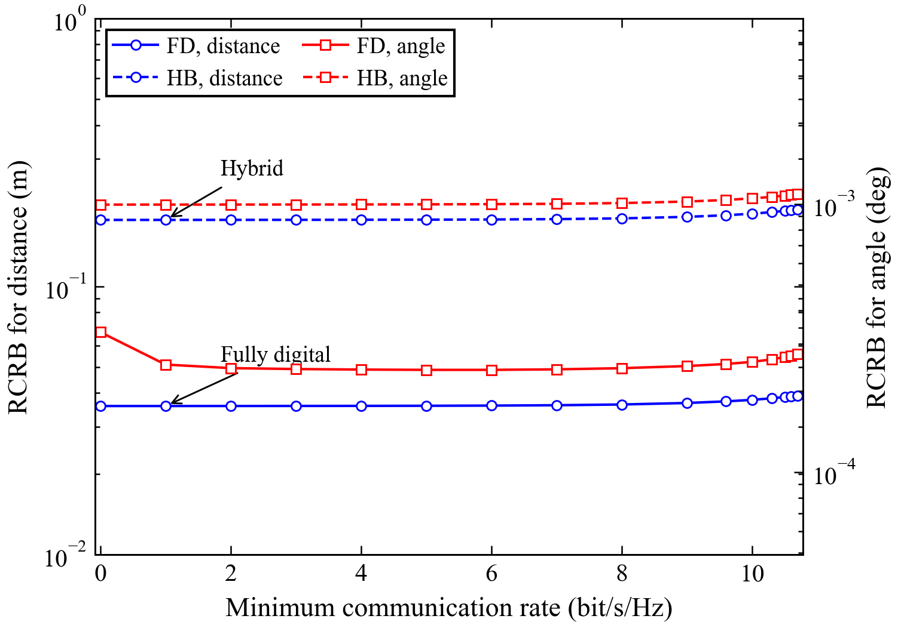
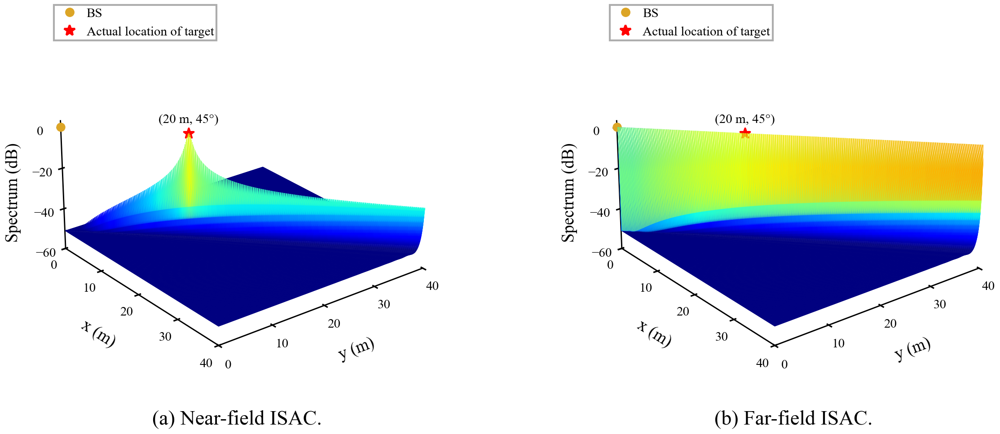
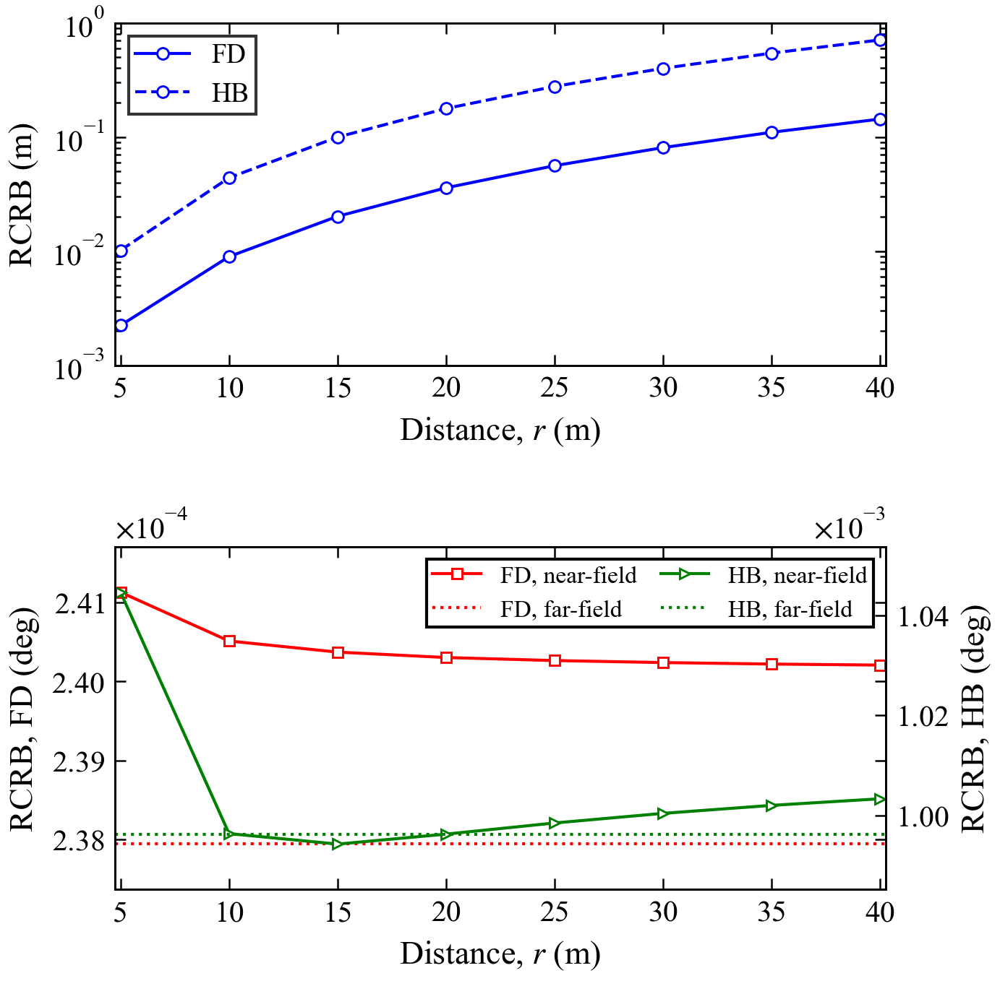
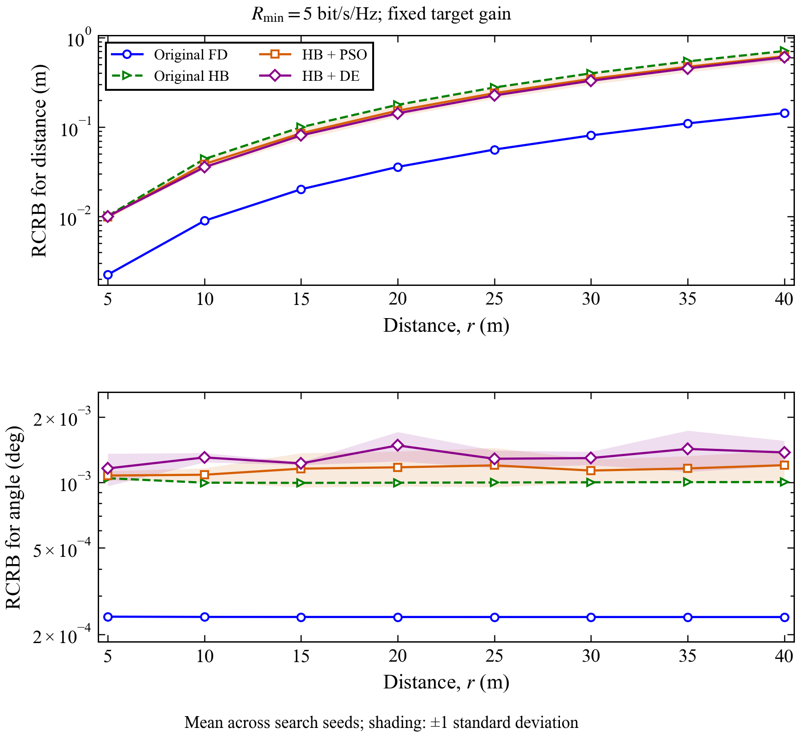
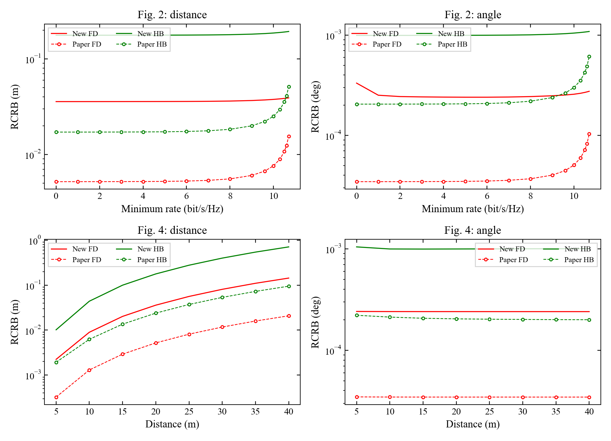

# Near-Field ISAC - Python reproduction

Reproduction of Z. Wang, X. Mu, and Y. Liu, **Near-Field Integrated Sensing and Communications**, IEEE Communications Letters, 2023. [Paper](https://arxiv.org/abs/2302.01153) · [Author MATLAB example](https://github.com/zhaolin820/near-field-integrated-sensing-and-communications).

The code implements exact spherical-wave channels, joint range/angle CRBs, fully digital SDR, two-stage hybrid beamforming, and MUSIC. The numerical revision adds exact transmit-subspace reduction, balanced inverse-FIM optimization, physical acceptance checks, rank-safe RF recovery, an independent far-field reference, and reproducible per-point artifacts.

Latest verification (**12 September 2026**): all 110 tests and lint passed;
the full MOSEK paper pipeline passed independent checks on 51 waveforms,
and the PSO/DE comparison passed all 64 waveform checks.
See the [pipeline audit](docs/pipeline_audit_2026-09-12.md) for the current
results, solver limitations and commands. The gallery below retains its dated
September 7–8 snapshots.

## Install and run

On this computer, open a PowerShell terminal and run:

```powershell
Set-Location "D:\NTK\PROJECTS\NEAR-FIELD ISAC"
& .\.venv\Scripts\Activate.ps1
python main.py all --preset paper --solver auto --solver-threads 2
python scripts/validate_results.py
```

The first command generates Figures 2–4; the second independently checks the saved
waveforms and generates the comparison report. Open
[`results/validation/report.md`](results/validation/report.md) after validation.
The project `.venv` on this computer has the required packages and licensed MOSEK.
If PowerShell blocks activation, replace `python` in these commands with
`.\.venv\Scripts\python.exe`.

For a fresh environment, use Python 3.10 or later and install the package first:

```bash
python -m pip install -e ".[optimization,dev]"
python main.py
```

The default runs the full paper preset and saves to **`results/`**. The main figure folders are `results/figure2/`, `results/figure3/`, and `results/figure4/`. Rerunning replaces their generated files; use `--output` to keep a separate run.

```bash
# Full 65-antenna pipeline, 16 rate points, 8 distances, 500x500 MUSIC grid
python main.py all --preset paper --solver auto --solver-threads 2

# Independently validate saved waveforms and compare against digitized paper values
python scripts/validate_results.py

# Compare selected results across solver tolerances and MOSEK/CLARABEL
python scripts/check_solver_convergence.py

# Reduced sampling, preserving all physical paper dimensions
python main.py all --preset quick --output results/quick

# Tiny installation/integration check
python main.py all --preset smoke --output results/smoke

# Individual figures; standalone Figure 3 now defaults to SDR
python main.py figure2 --preset paper
python main.py figure3 --preset paper --optimizer sdr
python main.py figure4 --preset paper
```

MOSEK requires a separate installation and license. Auto mode prefers MOSEK, then CLARABEL, then SCS. A solver result must pass physical checks before it is saved as a successful point. Inaccurate or rejected attempts remain visible in the JSON diagnostics. MOSEK is strongly preferred for resolving the small angle contribution to the mixed-unit objective. A fallback solver is not guaranteed to produce identical component CRBs.

The physical model remains N=65 antennas, K=4 users, five RF chains, 128 snapshots, 28 GHz, 0.5 m aperture, 20 dBm transmit power, -60 dBm noise, and target (20 m, 45 degrees). The default seed remains 2023. No reflection-gain fitting or seed search is used to match the printed figures.

## Output

Each experiment writes a 300-dpi PNG, an SVG, CSV/JSON results, a complete scenario NPZ, provenance JSON, and the optimized waveforms with solver diagnostics. Figure 3 rasterizes only its full-resolution surface in the SVG. Figure 4 additionally saves both independently optimized far-field waveforms.

```text
results/
  all_summary.json
  figure2/
    figure2_rcrb_vs_rate.png / .svg / .csv
    figure2_summary.json
    provenance.json / scenario.npz
    point_000.npz / point_000.json / ...
  figure3/
    figure3_music_spectrum.png / .svg
    figure3_music_data.npz / figure3_summary.json
    provenance.json / scenario.npz / nominal.npz / nominal.json
  figure4/
    figure4_rcrb_vs_distance.png / .svg / .csv
    figure4_summary.json
    provenance.json / scenario.npz
    point_000.npz / point_000.json / ...
    far_fully-digital-sdr.npz / .json
    far_hybrid-two-stage-sdr.npz / .json
  validation/
    summary.json / physical_checks.csv / paper_comparison.csv
    comparison_to_paper.png / normalized_comparison.png
    report.md / solver_convergence.json
```

Every solution records achieved rates, power margin, covariance eigenvalues, inverse-FIM epigraph discrepancy, solver status and attempts, tolerance, and physical CRB trace. Each experiment records the full configuration, exact channel/reflection/combiner realization, package versions, and source hashes. Specify `--output` to preserve another run; files in a selected output directory are replaced on rerun.

For a separate full run and its validation:

```bash
python main.py all --preset paper --solver-threads 2 --output results/my-run
python scripts/validate_results.py --results results/my-run
python scripts/check_solver_convergence.py --results results/my-run
```

The comparison validator expects all three figures from the same source revision.
Run the full pipeline again after source changes; do not combine individual outputs from
different runs. Quick/smoke presets are useful for checks, but the gallery below uses the
full paper preset. The optional convergence script specifically compares MOSEK and CLARABEL.

## Produced figures and comments

The additional PSO/DE comparison can be run independently:

```powershell
python main.py metaheuristics --preset paper --solver MOSEK --solver-threads 1 --workers 4
python scripts/validate_metaheuristics.py --original-figure4 results/figure4
```

It compares original FD/HB with PSO + SDR and DE + SDR over the Figure 4 distance
grid, using the same physical scenario and three paired search seeds. Outputs
go to `results/metaheuristics/`, including two comparison/convergence plots,
per-restart CSVs, saved RF/baseband waveforms, and evaluation logs. Each algorithm
receives 252 fitness requests per restart; the analog search uses ten virtual
focusing coordinates. See the [method and settings](docs/metaheuristics.md).

These are saved results from the validated **7 September 2026** run: paper preset,
seed 2023, MOSEK, tolerance 1e-11, 65 antennas, 16 rate points, 8 distances and a
500 × 500 MUSIC grid. Figures 2 and 4 were rendered again on 8 September to
correct their legends and the missing upper distance axis in Figure 4; numerical
values are unchanged. See the [legend and axis audit](docs/figure_visual_audit.md).
Images in `docs/results/` are documentation snapshots; rerunning the pipeline
updates `results/`, not this gallery.

### Figure 2 — sensing versus communication rate



Fully digital beamforming achieves lower range and angle RCRBs than the hybrid design
in this realization. The high-rate increase is much weaker than in the paper.
At 5 bit/s/Hz, the quantitative comparison is:

| Design | Quantity | Produced | Digitized paper | Produced / paper |
|---|---|---:|---:|---:|
| Fully digital | Range RCRB (m) | 0.035866956 | 0.0052345414 | 6.852 |
| Fully digital | Angle RCRB (deg) | 0.0002403039 | 0.00003475439 | 6.914 |
| Hybrid | Range RCRB (m) | 0.1774955 | 0.01729069 | 10.265 |
| Hybrid | Angle RCRB (deg) | 0.0009962601 | 0.0002063814 | 4.827 |

The zero-rate fully digital angle is still sensitive across solvers because its
contribution to the mixed-unit objective is very small. Individual angle CRBs are
not guaranteed to increase monotonically with the rate constraint.

### Figure 3 — MUSIC localization

The Figure 3 view was rotated on 8 September 2026 to match the paper. This gallery panel comes from the rerun with that camera setting; the numerical spectrum is unchanged.



Near-field MUSIC estimates **19.952031 m at 45°**, matching the paper's rounded
**19.952 m at 45°** estimate. The far-field spectrum cannot distinguish range along
the target direction. This agreement checks the reported peak location; it does
not establish identical spectrum values at every grid point.

### Figure 4 — sensing versus target distance



Range RCRB increases with target distance, and the fully digital range curve has a
similar trend to the paper but remains about 6.9 times larger. Hybrid angle RCRB
falls initially and then rises slightly, unlike the paper's decreasing curve.
Read the separate FD and HB angle axes carefully. The horizontal far-field lines
come from separately optimized angle-only designs under the documented
[reference convention](docs/numerical_method.md); they are not universal bounds
across different sensing models and hybrid transmit subspaces.

See [why Figure 4 differs](docs/figure4_discrepancies.md) for the measured scale offsets, hybrid shape differences and unresolved modeling assumptions.

### Figure 4 — additional PSO/DE comparison



The new algorithms optimize ten virtual RF focusing coordinates, with the
original SDR solving the digital stage for every candidate. This run uses the
same paper preset, channel seed 2023, fixed target gain and receive combiner as
the original Figure 4. Both methods receive 252 fitness requests per restart
and identical initial populations for search seeds 101, 202 and 303. Curves show
the mean and shading shows one sample standard deviation across these restarts.
Both panels use common logarithmic axes to compare physical values directly.

At 20 m, PSO lowers mean range RCRB from 0.17750 m to 0.15271 m (**13.96%**),
and DE to 0.14274 m (**19.58%**). Mean trace CRB decreases by **24.99%** and
**35.25%**, respectively. Angle RCRB increases by **17.67%** and **48.38%**:
the original mixed-unit objective prioritizes range variance. These are gains
in the optimized total with an angle-accuracy tradeoff, not improvements in
every sensing metric. Three search restarts on one channel do not establish
performance over a distribution of channels or global convergence.

See the [convergence plot](docs/results/2026-09-08/metaheuristics/metaheuristic_convergence.png),
[numerical comparison](docs/results/2026-09-08/metaheuristics/comparison.csv), and
[method/settings explanation](docs/metaheuristics.md). The raw evaluation logs
and RF/baseband waveforms are in `results/metaheuristics/`. Timings and actual
SDR call counts are reported separately; repeated fitness requests use a cache.
The full comparison completed in 438.4 seconds with four workers. All 64 saved
waveforms passed independent validation (maximum finite-difference CRB error:
0.000257928%), and all 36 tests passed. See the
[validation record](docs/results/2026-09-08/metaheuristics/validation.json).

### Cross-validation and remaining disagreement



All **48 curve points** passed independent rate, power, covariance and CRB checks.
The largest finite-difference CRB discrepancy was **0.000257928%**. The smallest
rate margin was −8.76e-6 bit/s/Hz, within the explicit −1e-5 acceptance tolerance.
The test suite passed all 27 tests. See the saved
[validation summary](docs/results/2026-09-07/summary.json) and
[cross-solver results](docs/results/2026-09-07/solver_convergence.json).

**Figures 2 and 4 are not exact numerical reproductions.** The original sweep
implementation and exact random realization are unavailable in the supplied
materials. The cause of the remaining differences is unresolved; these checks do
not justify attributing it to randomness alone. No fitted scaling or smoothing is
applied. Physical consistency and agreement with the historical paper plots are
separate validation questions.

## Code layout

| Location | Responsibility |
|---|---|
| `main.py`, `src/near_field_isac/cli.py` | Entry point, presets and command-line options |
| `config.py`, `channels.py`, `communication.py` | Physical model, scenarios and communication waveforms |
| `fim.py`, `optimization.py` | CRBs, SDR and physical acceptance checks |
| `music.py` | Echo simulation and localization |
| `experiments.py` | Sweeps, saved artifacts and provenance |
| `plotting.py` | Shared figure styling and rendering |
| `scripts/` | Validation, reference extraction and individual-figure wrappers |
| `tests/` | Numerical and integration regression checks |
| `docs/` | Numerical conventions, paper notes, references and gallery snapshots |

Module filenames in this table are under `src/near_field_isac/` unless otherwise stated.
Generated experiment data remain in the Git-ignored `results/` directory; the small
documentation gallery is kept separately so README images work in a fresh checkout.

## Numerical method

The fully digital covariance is optimized in the exact span of the conjugated user channels and target response/derivative row spaces. This reduces the default SDP to seven transmit dimensions without changing the objective or feasible optimum. A rank-revealing SVD also handles repeated hybrid RF columns. These changes remove the need for the earlier memory-heavy N-by-N solver workload and disposable solver processes in normal runs.

The objective remains the paper's trace of range variance in m² plus angle variance in rad². It is not reweighted into degrees or equal normalized errors. Removing derivative components in the complex-gain nuisance span and balancing the inverse-information LMI improve numerical conditioning. The default conic tolerance is 1e-11. Unidentifiable or indefinite CRBs raise an error rather than being reported as zero.

The hybrid CRB retains the paper's approximation that combined noise has covariance N sigma² I. Optional hybrid MUSIC simulates physical combined noise and whitens both data and steering. Figure 3 in the main pipeline uses a fully digital receiver.

See [docs/numerical_method.md](docs/numerical_method.md) for the exact transformations, validation thresholds, and reconstruction assumptions.

## Comparing with the paper

The supplied paper's vector paths were calibrated against its axis ticks and exported to `docs/paper_reference/`. They provide a quantitative graph comparison, not the authors' original simulation arrays. The extraction script requires optional `pdfplumber`:

```bash
python scripts/extract_paper_reference.py "path/to/Near-Field ISAC.pdf"
```

The reference is tied to the supplied arXiv v5 PDF and records its SHA-256. Figure 2 uses its recovered rate grid: 0 through 9, then 9.6, 10, 10.3, 10.5, 10.6, and 10.7. Figure 3 uses the author's 500-point linspace grid and reproduces the stated estimate of 19.952 m at 45 degrees.

Figure 4's target gain is fixed at its nominal realization to remove range-dependent pathloss. Its horizontal references now come from separate angle-only optimization with planar target steering, fixed near-field communication channels, and the same receive combiner. The hybrid target RF column is planar; user columns remain spherical. This is a documented reconstruction convention, not a claim that the original unpublished Figure 4 code used exactly that convention.

Substantial amplitude and shape differences from the historical plots can remain. Random user locations, complex reflection, hybrid combiner, missing original sweep scripts, and the author's corrected FIM implementation limit exact reproduction. The default FD zero-rate angle is also more sensitive across solvers than the total objective. The validation outputs expose these differences. No smoothing, fitted amplitude multiplier, or forced monotonic angle curve is applied.

## Tests

```bash
python -m pytest -q
python -m ruff check src tests scripts
```

Regression checks cover singular CRBs, extreme information scaling, an independent vectorized echo Jacobian, exact transmit-subspace invariance, full/reduced SDP agreement, rank-deficient hybrid RF reconstruction, colored-noise MUSIC, and endpoint-independent far-field references, in addition to the original tests.

## Citation

```bibtex
@article{wang2023nearfieldisac,
  author = {Zhaolin Wang and Xidong Mu and Yuanwei Liu},
  title = {Near-Field Integrated Sensing and Communications},
  journal = {IEEE Communications Letters},
  volume = {27}, number = {8}, pages = {2048--2052}, year = {2023},
  doi = {10.1109/LCOMM.2023.3280132}
}
```

This project retains its MIT license. The paper and author repository have their own licenses.
