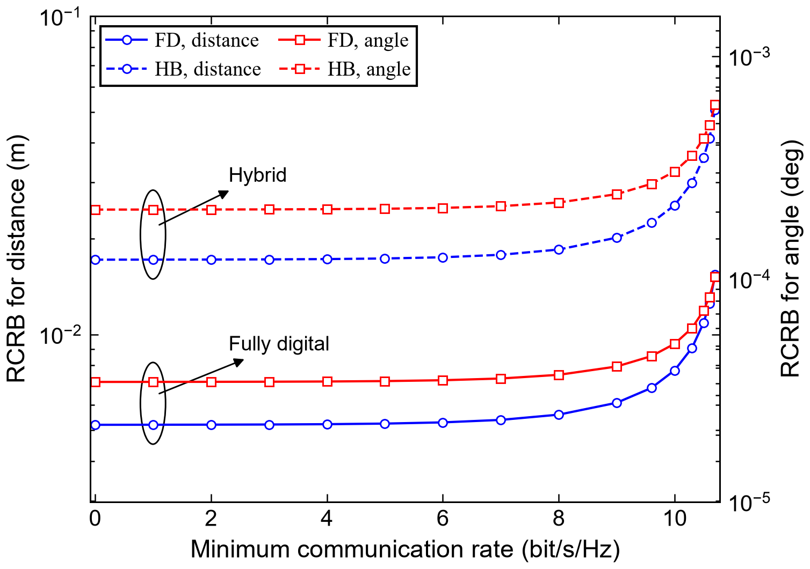
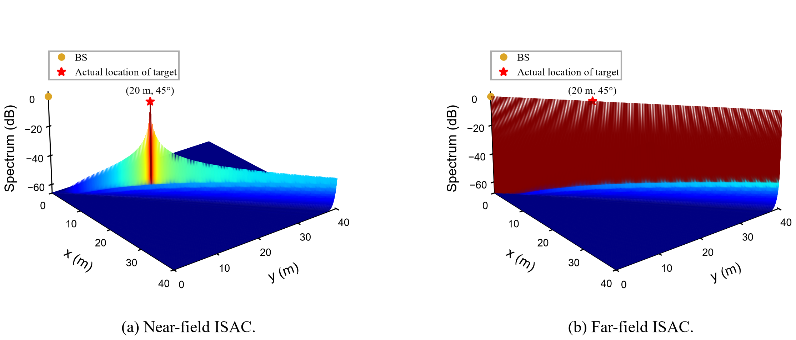
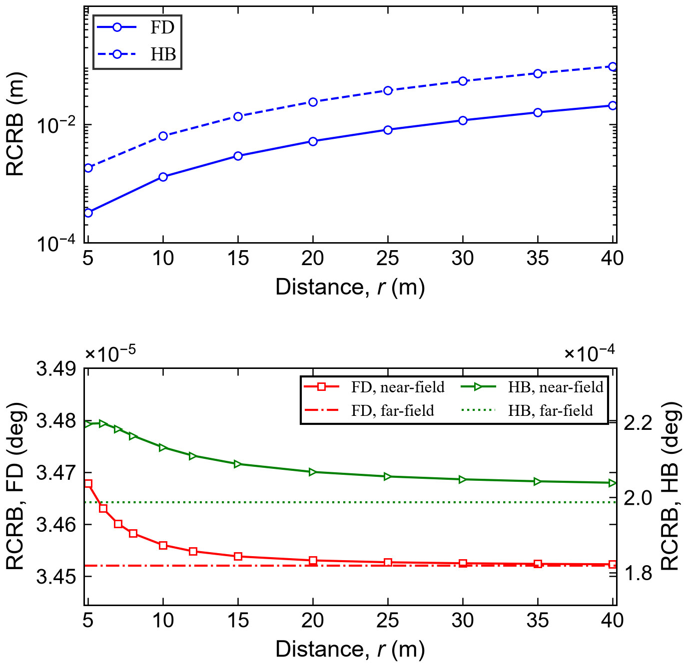
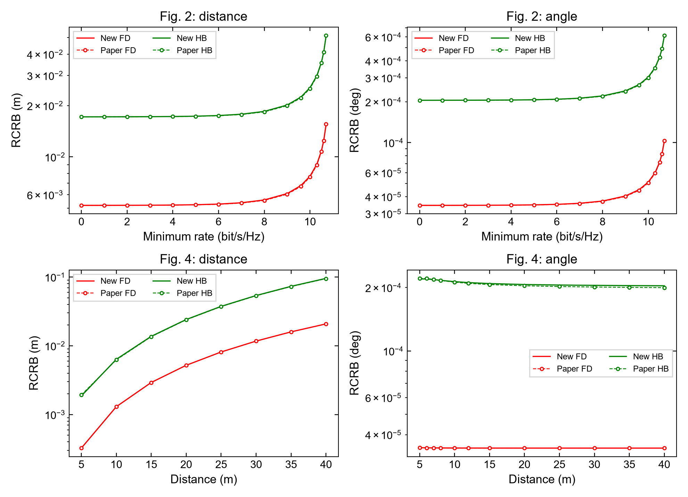
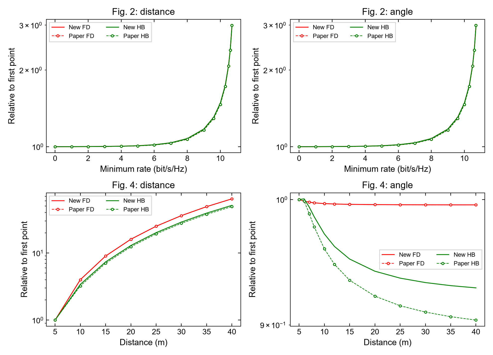

# Near-Field ISAC - Python reproduction

Reproduction of Z. Wang, X. Mu, and Y. Liu, **Near-Field Integrated Sensing and Communications**, IEEE Communications Letters, 2023. [Paper](https://arxiv.org/abs/2302.01153) · [Author MATLAB example](https://github.com/zhaolin820/near-field-integrated-sensing-and-communications).

The code implements the paper's spherical-wave channels, joint range/angle CRB, fully digital SDR, two-stage hybrid beamforming and near-field MUSIC, and reproduces Figures 2–4.

**Status:** all three figures match the paper.

| Figure | Agreement with the digitized paper curves |
|---|---|
| Fig. 2 — RCRB vs. minimum rate | all 64 points within 1.2 % (mean 0.5 %) |
| Fig. 3 — MUSIC spectrum | estimate 19.952 m, 45°, identical to the paper |
| Fig. 4 — RCRB vs. distance | FD within 0.05 %; HB within 3.4 % |

All 59 saved waveforms pass an independent physical validation; all tests and lint pass.

## Quick start

From the repository root, with a virtual environment that has the package and a licensed MOSEK installed (PowerShell shown):

```powershell
& .\.venv\Scripts\Activate.ps1
python main.py all --preset paper --solver auto --solver-threads 2 --workers 3
python scripts/validate_results.py
```

The first command produces the three figures in `results/figure2`, `results/figure3` and `results/figure4` in under a minute. The second cross-validates them (see [Cross-validation with the paper](#cross-validation-with-the-paper)) and writes `results/validation/report.md`. If PowerShell blocks activation, replace `python` with `.\.venv\Scripts\python.exe`.

In a fresh environment (Python 3.10+):

```bash
python -m pip install -e ".[optimization,dev]"
python main.py            # same as: python main.py all --preset paper
```

MOSEK needs its own installation and licence. `--solver auto` tries MOSEK, then CLARABEL, then SCS. CLARABEL alone cannot solve the highest-rate points of Fig. 2, so the full pipeline needs MOSEK.

### Other commands

```bash
python main.py figure2 --preset paper        # one figure at a time
python main.py figure3 --preset paper
python main.py figure4 --preset paper
python main.py all --preset quick --output results/quick   # fewer sweep points, same model
python main.py all --preset smoke --output results/smoke   # tiny model, installation check
python main.py all --output results/my-run                 # keep a separate run
python scripts/validate_results.py --results results/my-run
```

Rerunning into the same folder replaces its files.

## Setting

The physical model is the paper's: N = 65 antennas (ULA, aperture 0.5 m), K = 4 users, 5 RF chains, T = 128 snapshots, 28 GHz, 20 dBm transmit power, −60 dBm noise, target at (20 m, 45°). Figure 2 sweeps R_min over 0–10.7 bit/s/Hz; Figures 3 and 4 use R_min = 5 bit/s/Hz.

The paper leaves some details unreported. Two options control them:

| Option | Default | Meaning |
|---|---|---|
| `--realization paper` | paper and quick presets | User locations, target reflection and hybrid combiners recovered from the paper's figures |
| `--realization random` | smoke preset | Independent random draw from `--seed`, as the authors' `generate_channel.m` does |
| `--crb-signal dedicated` | all presets | CRB from the dedicated sensing signal `R_s`; required to reproduce Fig. 2 |
| `--crb-signal total` | — | CRB from the whole transmit signal `R_x`, as Eq. (13) is written |

`--seed` (default 2023) also drives the MUSIC symbols and noise. The evidence behind each choice is in [docs/reproduction.md](docs/reproduction.md).

## Produced figures

Snapshot of a validated run (paper preset, MOSEK). Rerunning updates `results/`, not these images in `docs/results/`.

### Figure 2 — sensing versus communication rate



The sensing–communication tradeoff: all four curves stay flat up to about 8 bit/s/Hz, then rise by a common factor of 3 at 10.7 bit/s/Hz, as in the paper.

### Figure 3 — MUSIC spectrum at R_min = 5 bit/s/Hz



Near-field MUSIC peaks at the target (19.952 m, 45°). The far-field spectrum is constant along the 45° direction, so it cannot resolve range.

### Figure 4 — sensing versus target distance at R_min = 5 bit/s/Hz



Range RCRB grows as r² as the wavefront flattens; the near-field angle RCRB decreases toward the far-field reference. As in the paper, pathloss is excluded from this sweep.

## Cross-validation with the paper

`python scripts/validate_results.py` checks the saved results in two independent ways. It does not rerun the optimizer.

**1. Physical checks.** For every saved waveform (32 in Fig. 2, 24 in Fig. 4, the 2 far-field references and the Fig. 3 waveform), it recomputes from the raw arrays:

- each user's achieved rate against R_min,
- total transmit power against 20 dBm,
- validity of the covariance matrices (Hermitian, positive semidefinite, including the dedicated sensing part),
- the CRB, by finite differences of the echo — a calculation independent of the analytic FIM used during optimization,
- the MUSIC peak of Fig. 3 against the saved spectrum,
- the source-code hashes, so results from an older code version cannot pass.

Any failed check stops the script with an error.

**2. Comparison with the paper.** The paper's curves were extracted from the vector graphics in its PDF and calibrated against the axis ticks ([`docs/paper_reference/`](docs/paper_reference/)). Each produced point is compared with the paper value at the same coordinate, without interpolation or rescaling.

### Validation results

| Check | Result |
|---|---|
| Waveforms checked | 59, all passed |
| Largest CRB difference (analytic vs. finite differences) | 3.2 × 10⁻⁶ |
| Smallest rate margin | −3.6 × 10⁻¹⁰ bit/s/Hz (tolerance −10⁻⁵) |
| Fig. 3 MUSIC estimate | 19.952031 m, 45.000° (paper: 19.952 m, 45°) |

| Curve | Points | Mean deviation | Largest deviation |
|---|---:|---:|---:|
| Fig. 2, FD range | 16 | 0.54 % | 1.22 % (10 bit/s/Hz) |
| Fig. 2, FD angle | 16 | 0.54 % | 1.22 % (10 bit/s/Hz) |
| Fig. 2, HB range | 16 | 0.53 % | 1.21 % (10 bit/s/Hz) |
| Fig. 2, HB angle | 16 | 0.54 % | 1.22 % (10 bit/s/Hz) |
| Fig. 4, FD range | 8 | 0.04 % | 0.05 % |
| Fig. 4, FD angle | 12 | 0.04 % | 0.05 % |
| Fig. 4, HB range | 8 | 1.29 % | 3.41 % (5 m) |
| Fig. 4, HB angle | 12 | 1.07 % | 2.05 % (40 m) |

Selected points:

| Point | Quantity | Produced | Paper | Produced / paper |
|---|---|---:|---:|---:|
| Fig. 2, R_min = 0 | FD range (m) | 5.1985e-3 | 5.1985e-3 | 1.0000 |
| | FD angle (deg) | 3.4515e-5 | 3.4515e-5 | 1.0000 |
| | HB range (m) | 1.7169e-2 | 1.7172e-2 | 0.9999 |
| | HB angle (deg) | 2.0496e-4 | 2.0496e-4 | 1.0000 |
| Fig. 2, R_min = 10.7 | FD range (m) | 1.5391e-2 | 1.5557e-2 | 0.9893 |
| | HB range (m) | 5.0833e-2 | 5.1388e-2 | 0.9892 |
| Fig. 4, 20 m | FD range (m) | 5.2008e-3 | 5.1986e-3 | 1.0004 |
| | HB range (m) | 2.4073e-2 | 2.3865e-2 | 1.0087 |
| Fig. 4, 40 m | FD angle (deg) | 3.4523e-5 | 3.4508e-5 | 1.0005 |
| | HB angle (deg) | 2.0391e-4 | 1.9982e-4 | 1.0205 |

Absolute values, produced (solid) against the paper (dashed):



Shapes, each curve divided by its first point:



Full data: [summary.json](docs/results/summary.json) and [paper_comparison.csv](docs/results/paper_comparison.csv).

### Remaining differences

- **Fig. 2:** a systematic shape residual of up to 1.2 % near 10 bit/s/Hz. It comes from the user locations, which the paper does not report; none of about 1,600 candidate draws did better.
- **Fig. 4, hybrid:** the HB angle falls 7.2 % from 5 to 40 m, against 9.6 % in the paper, and stays 2.5 % above its far-field line at 40 m (paper: 0.3 %). The HB curves depend on the random receive combiner. The best of 6.4 million random combiners still leaves this gap.
- **Fig. 3:** the paper's spectrum is a single random realization; the peak position matches exactly, but surface details depend on the noise draw.

### How to read the agreement

The paper's random draws (user locations, target reflection coefficient, hybrid combiners) are not reported, and its code sets no seed. With `--realization paper` these values were chosen from the model's own distributions so that the curves match the paper ([docs/reproduction.md](docs/reproduction.md)). The close agreement therefore confirms the model, conventions and algorithms; it is not an independent random draw. With `--realization random` the trends are the same, but the absolute levels follow the draw.

Three fixes were needed for the agreement:

1. a second, lexicographic optimization stage, so that the angle CRB is optimized rather than left to solver noise;
2. the CRB of the dedicated sensing signal (`--crb-signal dedicated`);
3. no pathloss on the user channels in Fig. 4.

[docs/reproduction.md](docs/reproduction.md) gives the evidence for each.

## Code layout

| Location | Responsibility |
|---|---|
| `main.py`, `src/near_field_isac/cli.py` | Entry point, presets and command-line options |
| `config.py` | System parameters and presets |
| `channels.py` | Near/far-field array responses and scenarios (Eqs. 1–7) |
| `communication.py` | Waveform container and achievable rate (Eq. 11) |
| `fim.py` | Fisher information and CRB (Eq. 13, Appendix B) |
| `optimization.py` | Fully digital SDR, hybrid two-stage design (Eqs. 20–22), validity checks |
| `music.py` | Echo simulation and near/far-field MUSIC (Eqs. 23–24) |
| `realization.py` | Random draws recovered from the paper's figures |
| `experiments.py` | Figure 2–4 sweeps, saved data and provenance |
| `plotting.py` | Paper-style figure rendering |
| `scripts/validate_results.py` | Independent cross-validation against the paper |
| `scripts/extract_paper_reference.py` | Extracts the paper's curves from its PDF (needs `pdfplumber`) |
| `tests/` | Regression tests |
| `docs/` | Reproduction notes, numerical method, paper walk-through, paper reference data |

Module files are in `src/near_field_isac/`.

## Output

```text
results/
  all_summary.json
  figure2/   figure2_rcrb_vs_rate.png/.svg/.csv, figure2_summary.json,
             provenance.json, scenario.npz, point_XXX.npz/.json
  figure3/   figure3_music_spectrum.png/.svg, figure3_music_data.npz,
             figure3_summary.json, provenance.json, scenario.npz, nominal.npz/.json
  figure4/   figure4_rcrb_vs_distance.png/.svg/.csv, figure4_summary.json,
             provenance.json, scenario.npz, point_XXX.npz/.json,
             far_fully-digital-sdr.npz/.json, far_hybrid-two-stage-sdr.npz/.json
  validation/  report.md, summary.json, physical_checks.csv, paper_comparison.csv,
               comparison_to_paper.png, normalized_comparison.png
```

Each `point_XXX` holds one optimized waveform and its diagnostics: achieved rates, power margin, solver status, tolerance and CRB. Each `provenance.json` records the configuration, the realization, package versions and source hashes. Validate results from a single run of the current code; do not combine outputs from different code versions.

## Numerical method

The fully digital SDR is solved in the exact subspace spanned by the user channels and the target response and its derivatives (at most seven dimensions instead of 65), which leaves the optimum unchanged. The objective is the paper's trace of the CRB, range variance in m² plus angle variance in rad². Because the angle term is about 10⁻⁸ of the total, a second stage minimizes the angle CRB with the range CRB held at its optimum. The hybrid CRB uses the paper's combined-noise approximation N σ² I. Details and thresholds are in [docs/numerical_method.md](docs/numerical_method.md); [docs/paper_analysis.md](docs/paper_analysis.md) walks through the paper.

## Tests

```bash
python -m pytest -q
python -m ruff check src tests scripts
```

## Citation

```bibtex
@article{wang2023nearfieldisac,
  author = {Zhaolin Wang and Xidong Mu and Yuanwei Liu},
  title = {Near-Field Integrated Sensing and Communications},
  journal = {IEEE Communications Letters},
  volume = {27}, number = {8}, pages = {2048--2052}, year = {2023},
  doi = {10.1109/LCOMM.2023.3280132}
}
```

This project is MIT licensed. The paper and the authors' repository have their own licences.
