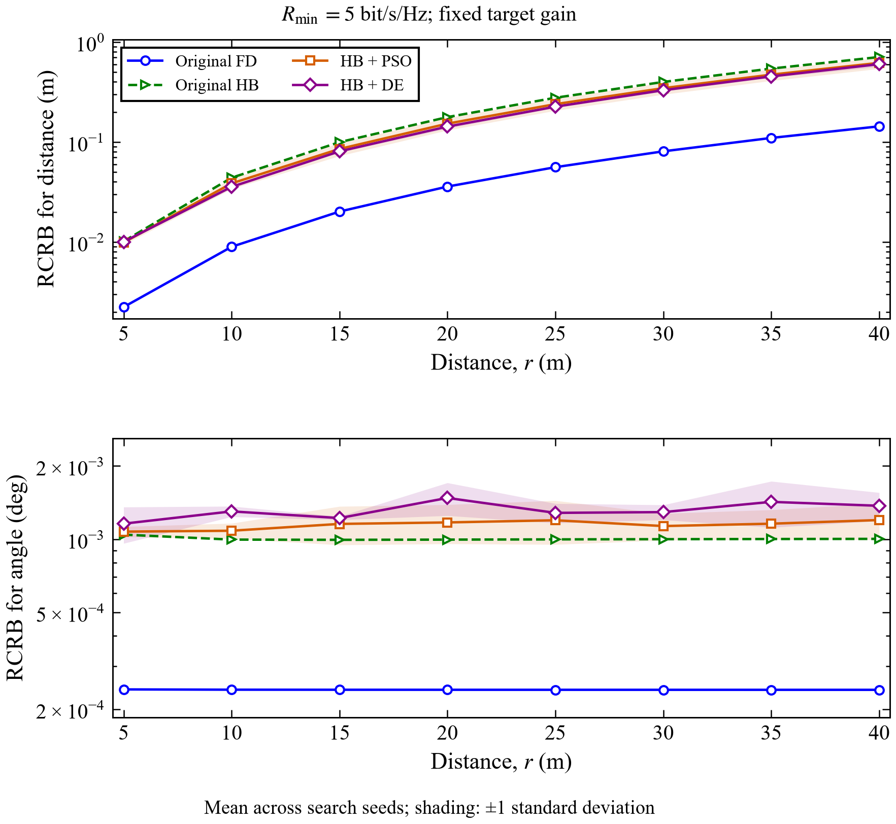
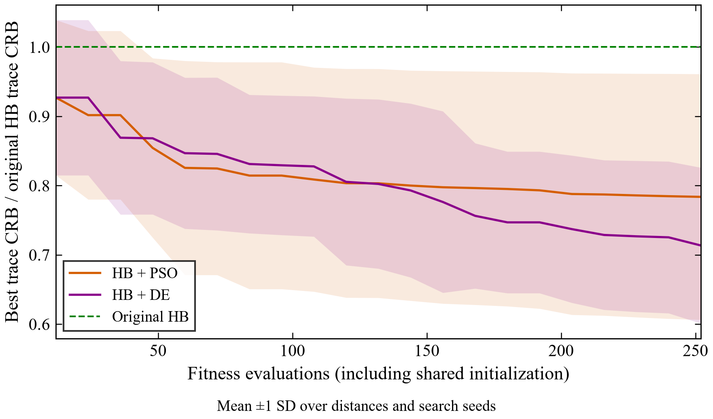

# Pipeline audit — 12 September 2026

The paper-preset Figures 2–4 pipeline completed with the current working-tree
source, channel seed 2023, MOSEK, tolerance `1e-11`, one solver thread and one
sweep worker. It includes 16 communication-rate points, eight target distances,
and a 500 × 500 MUSIC grid. The run is saved separately in
`results/pipeline-complete-2026-09-12/`.

## Changes verified

- High-SINR communication inequalities are scaled by `max(1, SINR)`. This
  preserves their feasible set and avoids the earlier amplification of solver
  feasibility residuals into failed recovered communication rates.
- Input checks reject negative or nonfinite sweep values, invalid seeds and
  search budgets, and nonphysical RF matrices before expensive solver work.
- Independent validators check finite and Hermitian waveforms, power, rates,
  residual covariance, RF reconstruction and finite-difference CRBs. They also
  verify source manifests, complete sweep coverage, CSV/JSON agreement, MUSIC
  peak consistency, and the two optimized far-field references.
- The PSO/DE audit checks complete search histories, budgets, caching, paired
  initial populations, winning positions and aggregates. Validation remains
  active with Python's `-O` option, and a failed revalidation invalidates an
  earlier success record.

## Figures 2–4

All **51 waveforms** passed independent validation: 32 Figure 2 designs,
16 Figure 4 designs, two far-field references and one MUSIC transmit design.
The maximum finite-difference CRB discrepancy was **0.000257928%**. The smallest
communication-rate margin was **0 bit/s/Hz** (including the zero-rate cases),
against an acceptance threshold of `-1e-5`.
The [saved validation summary](results/2026-09-12/figure_validation.json)
records these measurements.

MUSIC estimated **19.952031020 m at 45°**. Figures 2–4 were visually inspected
after rendering; their legends, axes and target markers were readable.

## Full PSO/DE comparison

All **48 searches** and 16 FD/HB baseline solves completed across eight distances
using four workers in **845.4 seconds (14.1 minutes)**. All **64 saved waveforms**
passed the independent audit. The maximum finite-difference CRB discrepancy
was **0.000257928%**, the minimum communication-rate margin was
`1.10466e-10` bit/s/Hz, and the minimum power margin was `1.08827e-10` mW.
Source hashes match the current implementation. FD/HB RCRBs match the new
Figure 4 run to a maximum relative difference of `5.10703e-13%`.

See the [validation record](results/2026-09-12/metaheuristics/validation.json),
[comparison data](results/2026-09-12/metaheuristics/comparison.csv), and
[individual runs](results/2026-09-12/metaheuristics/runs.csv).

Each algorithm uses the same three search seeds (101, 202, 303), population 12
and 20 generations after initialization: **252 fitness requests per restart**.
The search varies ten virtual RF focusing coordinates while keeping the
physical scenario and original mixed-unit trace objective fixed.

| Method | Mean range RCRB (m) | Mean angle RCRB (deg) | Mean trace reduction vs HB |
|---|---:|---:|---:|
| Original FD | 0.035866957 | 0.00024030565 | 95.92% |
| Original HB | 0.17749550 | 0.00099626012 | 0% |
| HB + PSO | 0.15270894 | 0.0011723281 | 24.99% |
| HB + DE | 0.14274236 | 0.0014782706 | 35.25% |

PSO and DE reduce mean range RCRB by **13.96%** and **19.58%**, respectively,
while mean angle RCRB increases by **17.67%** and **48.38%**. These rounded
findings agree with the September 8 results. The original HB wins the PSO
restart with seed 101; that restart remains in the reported mean.
These are search restarts on one fixed channel, not a channel Monte Carlo study.

Both comparison figures were visually inspected after rendering. The range
and angle panels use common logarithmic axes across methods; shading shows
one sample standard deviation over search seeds. The convergence figure
normalizes each run by its corresponding original HB objective before
aggregating across distances and seeds.





## Solver comparison

The convergence script evaluated FD and HB at 0, 1, 5 and 10.7 bit/s/Hz, using
MOSEK at `1e-11` and `1e-12` and CLARABEL at `1e-11`.
All 16 MOSEK cases passed. Six CLARABEL cases passed with
`optimal_inaccurate` status; both 10.7 bit/s/Hz cases were rejected. FD reported
a solver failure and HB failed the covariance definiteness check.
CLARABEL therefore remains insufficient for the full published rate grid in
this environment. These rejections remain visible in the convergence record.
See the [24-case solver comparison](results/2026-09-12/solver_convergence.json).

At zero rate, the FD angle RCRB was 0.0002846604° with MOSEK at `1e-11`,
0.0002895748° with MOSEK at `1e-12`, and 0.0005282349° with CLARABEL, despite
similar range RCRBs. Separate angle accuracy remains sensitive because of the
mixed-unit objective. Physical validation does not establish identical solver
solutions or exact agreement with the paper.

## Test environment

The complete suite passed **110 tests**, and `ruff check src tests scripts`
passed. The environment used Python 3.14.7, NumPy 2.5.3, SciPy 1.18.1,
CVXPY 1.9.2, MOSEK 11.2.4, CLARABEL 0.11.1 and Matplotlib 3.11.2.

The restricted Windows test runner could not access pytest's temporary
directories. Running the same tests outside that sandbox passed; no tests
were skipped or weakened. The four-process experiment also requires Windows
pipe access unavailable inside that sandbox.

The [audit manifest](results/2026-09-12/audit_manifest.json) records test and
validator hashes, verification commands and numerical source provenance.

## Reproduce the audit

Run from the repository in PowerShell, using its installed virtual environment:

```powershell
.\.venv\Scripts\python.exe -m pytest -q
.\.venv\Scripts\python.exe -m ruff check src tests scripts
.\.venv\Scripts\python.exe main.py all --preset paper --solver MOSEK --solver-threads 1 --workers 1 --output results/pipeline-complete-2026-09-12
.\.venv\Scripts\python.exe scripts/validate_results.py --results results/pipeline-complete-2026-09-12
.\.venv\Scripts\python.exe scripts/check_solver_convergence.py --results results/pipeline-complete-2026-09-12
.\.venv\Scripts\python.exe main.py metaheuristics --preset paper --solver MOSEK --solver-threads 1 --workers 4 --output results/pipeline-complete-2026-09-12
.\.venv\Scripts\python.exe scripts/validate_metaheuristics.py --results results/pipeline-complete-2026-09-12/metaheuristics --original-figure4 results/pipeline-complete-2026-09-12/figure4
```

Changing the output directory preserves this run. The September 7–8 gallery
remains a historical snapshot; differences from the digitized paper curves
remain documented in [the Figure 4 analysis](figure4_discrepancies.md).
